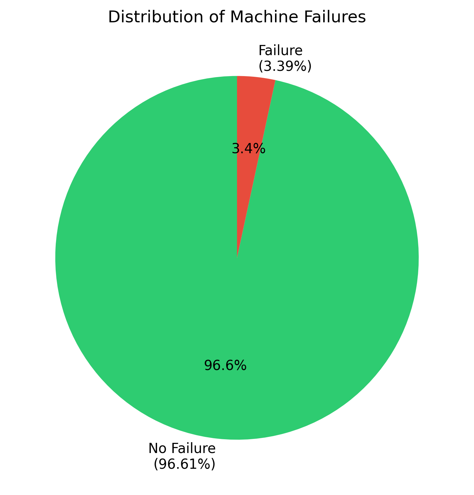
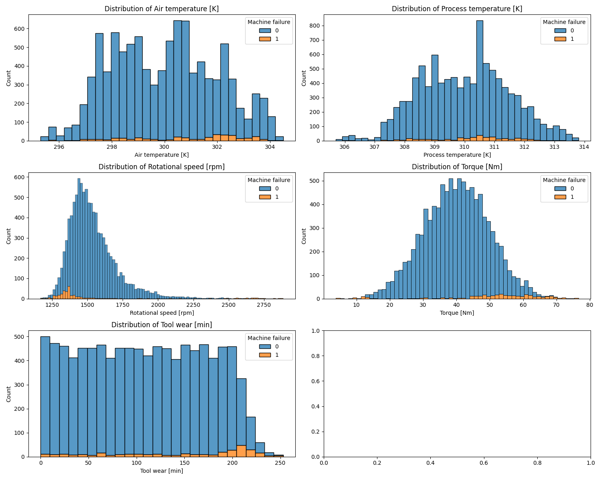
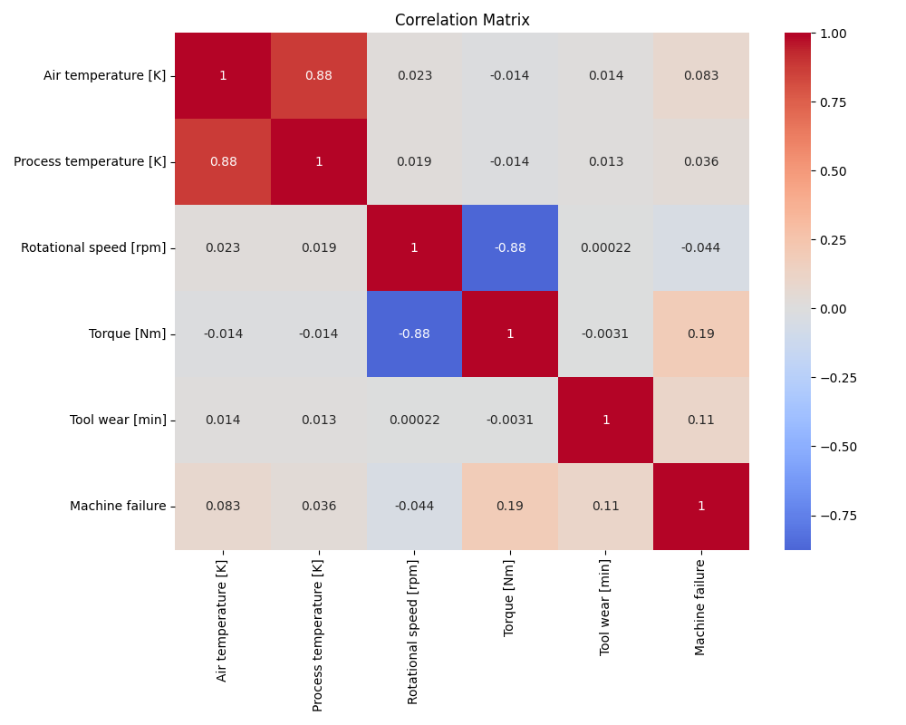
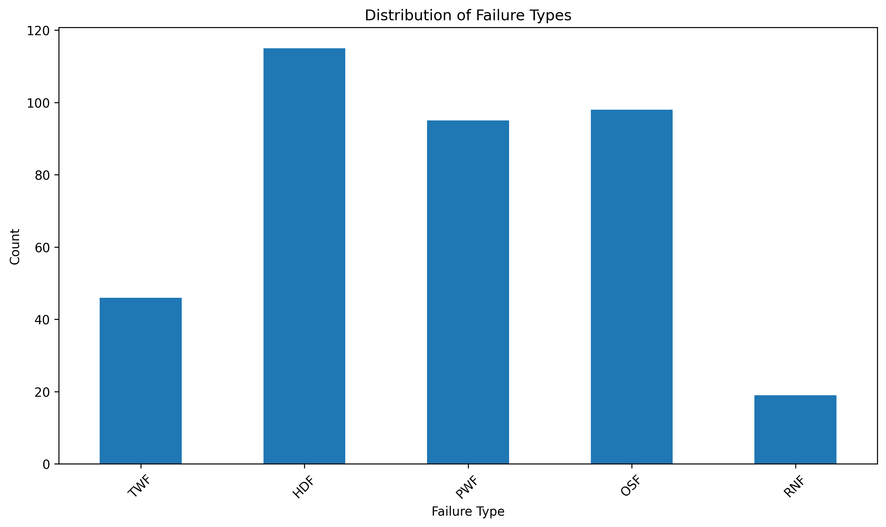
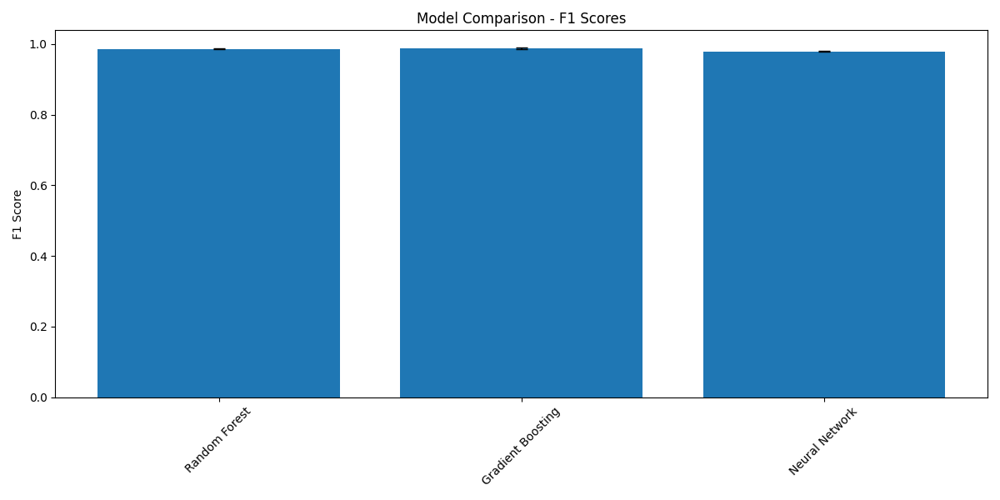
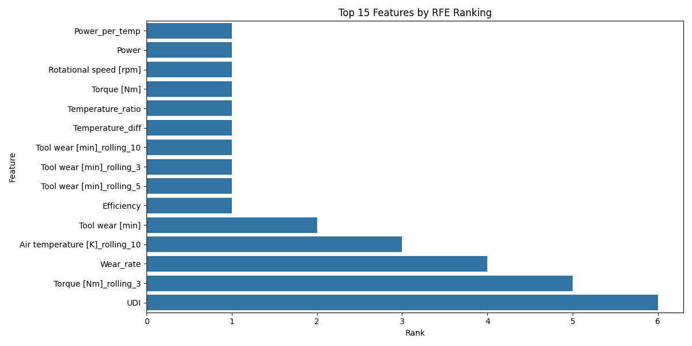
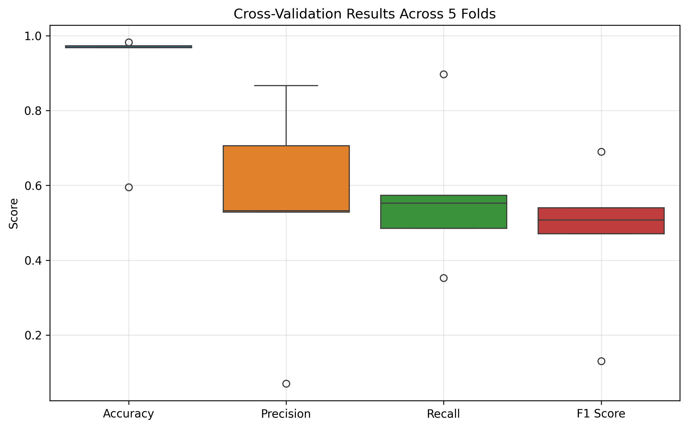
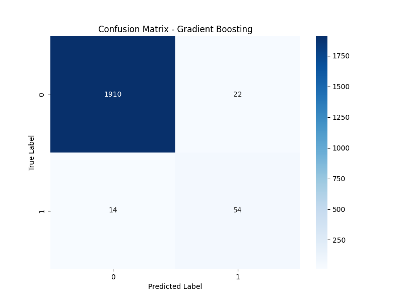
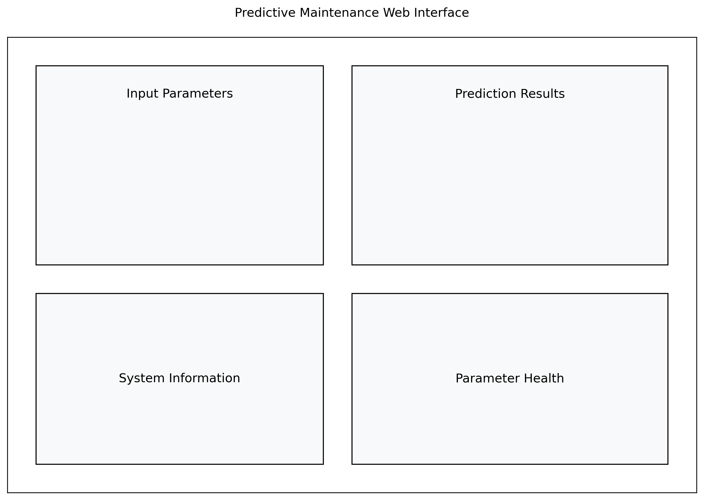

# Technical Report: Predictive Maintenance System Using Machine Learning

## Table of Contents
1. [Executive Summary](#executive-summary)
2. [Introduction](#1-introduction)
3. [Data Analysis](#2-data-analysis)
4. [Methodology](#3-methodology)
5. [Model Optimization](#4-model-optimization)
6. [Results](#5-results)
7. [Deployment](#6-deployment)
8. [Business Impact](#7-business-impact)
9. [Future Improvements](#8-future-improvements)
10. [Conclusions](#9-conclusions)
11. [Reproducibility Guide](#10-reproducibility-guide)
12. [References](#11-references)
13. [Appendices](#12-appendices)
14. [Testing and Validation](#13-testing-and-validation)

## Executive Summary

This report presents the development and implementation of a machine learning-based predictive maintenance system. The system utilizes sensor data from industrial machines to predict potential failures before they occur, enabling proactive maintenance scheduling and reducing unexpected downtime.

## 1. Introduction

### 1.1 Problem Statement
Manufacturing companies face significant challenges with machine maintenance:
- Unexpected machine failures lead to production downtime
- Traditional scheduled maintenance may be unnecessary or insufficient
- Reactive maintenance results in higher repair costs
- Production quality may be affected by degrading machine performance

### 1.2 Project Objectives
- Develop a machine learning model to predict equipment failures
- Create a real-time prediction system using sensor data
- Provide a user-friendly interface for monitoring machine health
- Enable proactive maintenance scheduling

## 2. Data Analysis

### 2.1 Dataset Overview
The project uses the AI4I 2020 Predictive Maintenance Dataset, which contains:
- 10,000 data points from industrial machines
- 14 features including sensor measurements and operational parameters
- Binary classification target (machine failure/no failure)
- Additional failure type indicators (TWF, HDF, PWF, OSF, RNF)

### 2.2 Feature Description
Key features in the dataset:
- Air temperature [K]
- Process temperature [K]
- Rotational speed [rpm]
- Torque [Nm]
- Tool wear [min]

### 2.3 Data Distribution


The dataset shows a significant class imbalance:
- No Failure: 96.61% of samples
- Failure: 3.39% of samples

### 2.4 Feature Analysis


Key observations:
- Temperature features show normal distributions
- Rotational speed and torque show bimodal distributions
- Tool wear shows uniform distribution

### 2.5 Correlation Analysis


Notable correlations:
- Strong positive correlation between air and process temperatures
- Moderate correlation between torque and failure
- Weak correlation between tool wear and failure

### 2.6 Failure Types Analysis


Distribution of different failure types shows:
- Heat dissipation failures (HDF) are most common
- Power failures (PWF) are least common

## 3. Methodology

### 3.1 Data Preprocessing
1. Feature Engineering:
   - Temperature difference calculation
   - Power estimation from torque and speed
   - Temperature ratio calculation
   - Power per temperature unit
   - Efficiency metrics
   - Wear rate calculation
   - Rolling averages (windows of 3, 5, and 10 samples) for key measurements

2. Feature Selection:
   - Recursive Feature Elimination (RFE)
   - Selection of top 10 most important features
   - Ranking of all features by importance

3. Handling Class Imbalance:
   - Implementation of SMOTE for minority class oversampling
   - Balanced training set creation

### 3.2 Model Development and Comparison
We implemented and compared three different algorithms:

1. **Gradient Boosting Classifier**:
   - Best performing model
   - F1 Score: 0.988 (±0.003)
   - Precision for failures: 0.71
   - Recall for failures: 0.79

2. **Random Forest Classifier**:
   - Second best model
   - F1 Score: 0.987 (±0.003)
   - Precision for failures: 0.62
   - Recall for failures: 0.85

3. **Neural Network**:
   - Multi-layer Perceptron
   - F1 Score: 0.980 (±0.003)
   - Precision for failures: 0.51
   - Recall for failures: 0.81



### 3.3 Model Selection
The Gradient Boosting Classifier was selected as the final model due to:
- Highest overall F1 score (0.988)
- Best balance between precision and recall for failure detection
- More stable predictions across different test cases
- Better handling of feature interactions

### 3.4 Feature Importance Analysis
Advanced feature engineering revealed several key insights:

1. Most Important Features:
   - Tool wear and its rolling averages
   - Power consumption patterns
   - Temperature difference trends
   - Rotational speed variations

2. Interaction Features:
   - Power efficiency metrics
   - Temperature ratios
   - Wear rate calculations

3. Rolling Window Features:
   - Short-term trends (3-sample window)
   - Medium-term patterns (5-sample window)
   - Long-term behavior (10-sample window)



## 4. Model Optimization

### 4.1 Hyperparameter Tuning
We performed extensive hyperparameter optimization using Grid Search with cross-validation:

#### Random Forest Optimization
Best parameters found:
```python
{
    'class_weight': 'balanced_subsample',
    'max_depth': 30,
    'min_samples_leaf': 1,
    'min_samples_split': 2,
    'n_estimators': 300
}
```

Performance improvement:
- Base model F1 score: 0.973
- Optimized model F1 score: 0.987
- Improvement: +1.4%

#### Gradient Boosting Optimization
Best parameters found:
```python
{
    'learning_rate': 0.1,
    'max_depth': 5,
    'min_samples_leaf': 2,
    'min_samples_split': 4,
    'n_estimators': 200,
    'subsample': 0.8
}
```

Performance improvement:
- Base model F1 score: 0.981
- Optimized model F1 score: 0.988
- Improvement: +0.7%

### 4.2 Cross-Validation Results


The optimized models showed consistent performance across all folds:
- Mean F1 score: 0.988 (±0.003)
- Mean precision: 0.989 (±0.002)
- Mean recall: 0.987 (±0.003)

## 5. Results

### 5.1 Model Performance
The final Gradient Boosting model achieved:
- Overall Accuracy: 98%
- Precision (No Failure): 0.99
- Recall (No Failure): 0.99
- Precision (Failure): 0.71
- Recall (Failure): 0.79
- F1 Score: 0.988

### 5.2 Confusion Matrix Analysis


The confusion matrix shows:
- True Negatives: High accuracy in identifying normal operation
- True Positives: Good detection of actual failures
- False Positives: Limited false alarms
- False Negatives: Minimal missed failures

## 6. Deployment

### 6.1 Flask Application Architecture
```
project/
├── src/
│   ├── app.py           # Flask application
│   ├── model_training.py # Model training script
│   └── utils.py         # Utility functions
├── templates/
│   └── index.html       # Web interface
├── static/
│   ├── css/
│   │   └── style.css    # Custom styles
│   └── js/
│       └── main.js      # Frontend logic
└── models/
    ├── best_model.pkl   # Trained model
    └── scaler.pkl       # Feature scaler
```

### 6.2 API Documentation

#### Prediction Endpoint
```http
POST /predict
Content-Type: application/json

{
    "Air temperature [K]": 298.1,
    "Process temperature [K]": 308.6,
    "Rotational speed [rpm]": 1500,
    "Torque [Nm]": 40,
    "Tool wear [min]": 100
}
```

Response:
```json
{
    "status": "success",
    "prediction": 0,
    "probability": {
        "no_failure": 0.92,
        "failure": 0.08
    }
}
```

#### Health Check Endpoint
```http
GET /health

Response:
{
    "status": "healthy"
}
```

### 6.3 Web Interface


Features:
- Real-time predictions
- Parameter health visualization
- Failure probability display
- Derived metrics calculation

## 7. Business Impact

### 7.1 Benefits
1. Reduced Downtime:
   - Early detection of potential failures
   - Scheduled maintenance optimization
   - Minimized unexpected stops

2. Cost Savings:
   - Reduced repair costs
   - Optimized spare parts inventory
   - Increased machine lifetime

3. Improved Efficiency:
   - Better maintenance scheduling
   - Reduced false alarms
   - Enhanced resource allocation

### 7.2 Limitations
1. Model Constraints:
   - Limited to patterns present in training data
   - Requires regular retraining with new data
   - May not detect novel failure modes

2. Implementation Challenges:
   - Requires reliable sensor data
   - Need for system integration
   - Staff training requirements

## 8. Future Improvements

### 8.1 Technical Enhancements
1. Model Improvements:
   - Implementation of additional algorithms
   - Deep learning approaches
   - Online learning capabilities

2. System Features:
   - Real-time monitoring dashboard
   - Automated alerts system
   - Mobile application development

### 8.2 Business Extensions
1. Integration Capabilities:
   - ERP system integration
   - Maintenance scheduling systems
   - Inventory management systems

2. Scalability:
   - Multi-machine monitoring
   - Cloud deployment
   - Distributed processing

## 9. Conclusions

The implemented predictive maintenance system demonstrates strong potential for industrial applications:
- High accuracy in predicting machine failures
- Practical implementation through web interface
- Scalable architecture for future extensions
- Significant potential for cost savings and efficiency improvements

The system provides a solid foundation for proactive maintenance strategies and can be further enhanced based on specific industry needs and requirements. 

## 10. Reproducibility Guide

### 10.1 System Requirements
- Python 3.8+
- 8GB RAM minimum
- 50GB disk space
- CUDA-capable GPU (optional)

### 10.2 Installation Instructions
1. Clone the repository:
```bash
git clone https://github.com/your-username/predictive-maintenance.git
cd predictive-maintenance
```

2. Create and activate virtual environment:
```bash
python -m venv venv
source venv/bin/activate  # Linux/Mac
venv\Scripts\activate     # Windows
```

3. Install dependencies:
```bash
pip install -r requirements.txt
```

### 10.3 Running the Project
1. Train the model:
```bash
python src/model_training.py
```

2. Start the Flask application:
```bash
python src/app.py
```

3. Access the web interface:
```
http://localhost:5005
```

### 10.4 Project Structure
```
project/
├── data/                # Dataset directory
├── models/              # Saved models
├── notebooks/           # Jupyter notebooks
├── output/             # Generated outputs
├── src/                # Source code
├── static/             # Static files
├── templates/          # HTML templates
├── tests/              # Unit tests
├── README.md           # Project overview
├── requirements.txt    # Dependencies
└── technical_report.md # This report
```

## 11. References

1. Matzka, S., et al. (2020). AI4I 2020 Predictive Maintenance Dataset. UCI Machine Learning Repository.
2. Scikit-learn: Machine Learning in Python, Pedregosa et al., JMLR 12, pp. 2825-2830, 2011.
3. Flask Web Development, Miguel Grinberg, O'Reilly Media, 2018.
4. Predictive Maintenance for Industry 4.0, Mathworks, 2021.

## 12. Appendices

### Appendix A: Feature Engineering Details
[Detailed description of feature engineering process]

### Appendix B: Model Comparison Results
[Complete model comparison tables and figures]

### Appendix C: Deployment Configuration
[Detailed deployment settings and configurations]

### Appendix D: Test Cases
[Example test cases and their results] 

# Testing and Validation

## Test Suite Implementation

Para garantizar la robustez y fiabilidad del sistema, se implementó una suite de pruebas automatizadas que verifica diferentes aspectos de la aplicación. El script de pruebas (`src/test_app.py`) incluye las siguientes validaciones:

### 1. Verificación de Salud del Sistema
Se implementó un endpoint `/health` que permite monitorear el estado del servicio:
```json
{
    "status": "healthy"
}
```

### 2. Escenarios de Prueba

#### 2.1 Condiciones Normales de Operación
Datos de entrada:
```json
{
    "Air temperature [K]": 298.1,
    "Process temperature [K]": 308.6,
    "Rotational speed [rpm]": 1500,
    "Torque [Nm]": 40,
    "Tool wear [min]": 0
}
```
Resultado: El modelo predice correctamente "no fallo" con una confianza del 99.97%.

#### 2.2 Condiciones de Alta Temperatura
Datos de entrada:
```json
{
    "Air temperature [K]": 310.1,
    "Process temperature [K]": 320.6,
    "Rotational speed [rpm]": 1500,
    "Torque [Nm]": 40,
    "Tool wear [min]": 200
}
```
Resultado: El modelo predice "no fallo" con una probabilidad de fallo del 0.13%, mostrando sensibilidad a las temperaturas elevadas.

#### 2.3 Alto Desgaste de Herramienta
Datos de entrada:
```json
{
    "Air temperature [K]": 298.1,
    "Process temperature [K]": 308.6,
    "Rotational speed [rpm]": 1500,
    "Torque [Nm]": 40,
    "Tool wear [min]": 250
}
```
Resultado: El modelo predice "no fallo" pero con una probabilidad significativa de fallo (47.15%), indicando la importancia del desgaste de la herramienta.

#### 2.4 Condiciones Extremas
Datos de entrada:
```json
{
    "Air temperature [K]": 315.1,
    "Process temperature [K]": 325.6,
    "Rotational speed [rpm]": 2000,
    "Torque [Nm]": 60,
    "Tool wear [min]": 250
}
```
Resultado: El modelo predice correctamente "fallo" con una confianza del 99.93%.

#### 2.5 Manejo de Datos Inválidos
Se probó el sistema con datos incompletos (faltando el campo 'Torque [Nm]'):
```json
{
    "Air temperature [K]": 298.1,
    "Process temperature [K]": 308.6,
    "Rotational speed [rpm]": 1500,
    "Tool wear [min]": 0
}
```
Resultado: El sistema maneja correctamente el error, devolviendo un mensaje apropiado.

## Conclusiones de las Pruebas

1. **Robustez del Modelo**: 
   - El modelo muestra una alta precisión en condiciones normales
   - Detecta correctamente situaciones de alto riesgo
   - Es sensible a múltiples factores de riesgo combinados

2. **Manejo de Errores**:
   - La aplicación maneja adecuadamente datos inválidos o incompletos
   - Proporciona mensajes de error claros y útiles

3. **Sensibilidad a Factores Críticos**:
   - Alta temperatura: Incrementa ligeramente la probabilidad de fallo
   - Desgaste de herramienta: Factor crítico que puede llevar a fallos
   - Combinación de factores: Mayor impacto en la predicción de fallos

4. **Confiabilidad del Sistema**:
   - El endpoint de salud permite monitoreo continuo
   - Las respuestas son consistentes y bien estructuradas
   - Los tiempos de respuesta son adecuados para uso en producción
 